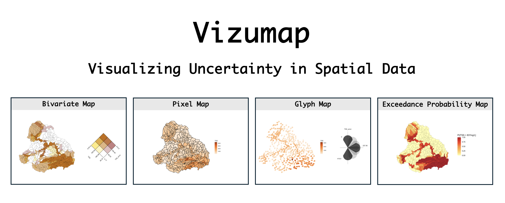
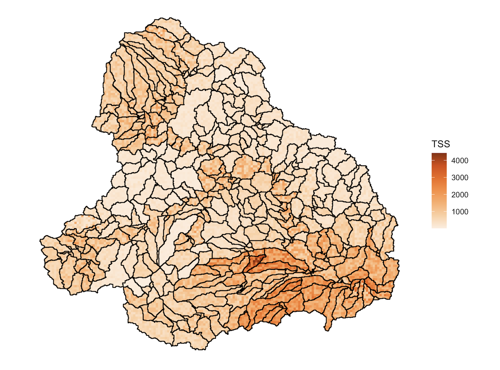
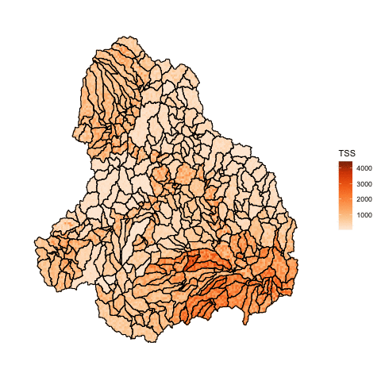
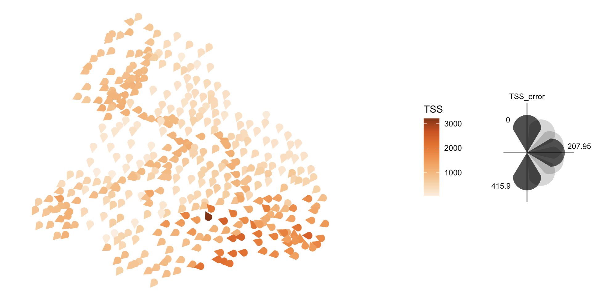
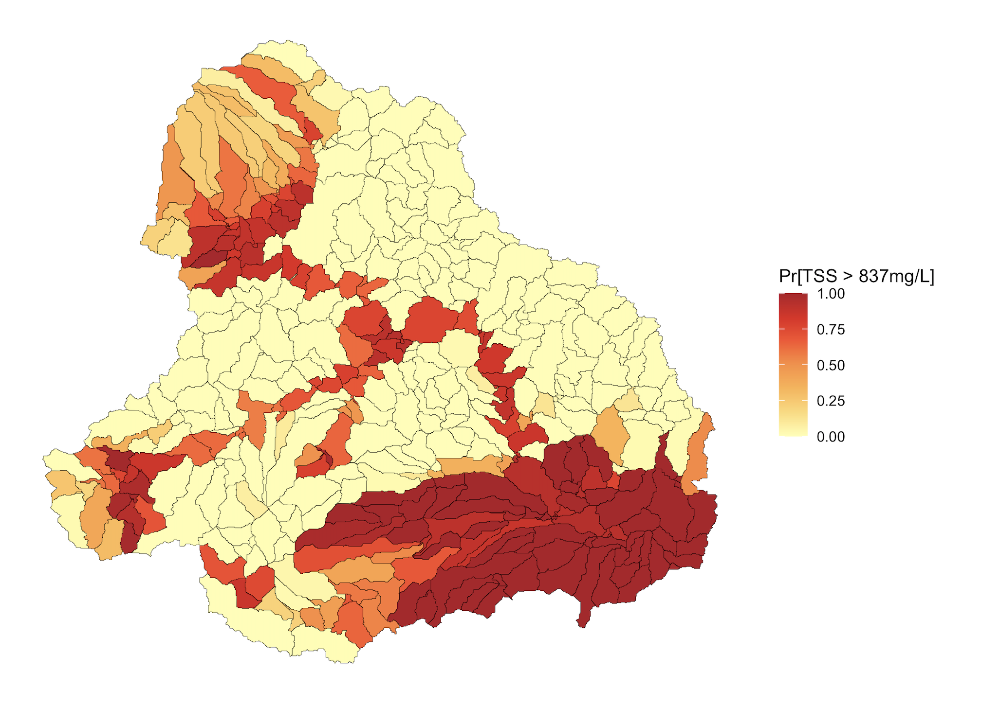

[](https://github.com/lydialucchesi/Vizumap/actions)

<center>

</center>

**Vizumap** is an R package for incorporating information about statistical uncertainty on maps visualizing statistical estimates. It provides support for building four different types of uncertainty maps: the bivariate map, the pixel map, the glyph map, and the exceedance probability map. Each of these maps is described below, alongside a quick start example. Additional information on Vizumap can be found in the Journal of Open Source Software (JOSS) [paper](https://doi.org/10.21105/joss.02409) or `vignette("Vizumap")`.

## Table of contents

* [Package installation and vignette](#package-installation-and-vignette)
* [Maps and quick start examples](#maps-and-quick-start-examples)
  * [Bivariate](#bivariate)
  * [Pixel](#pixel)
    * [Animated pixel](#animated-pixel)
  * [Glyph](#glyph)
  * [Exceedance probability](#exceedance-probability)
* [Practical applications](#practical-applications)
* [Contribute](#contribute)
* [License](#license)
* [Vizumap citation](#vizumap-citation)
* [References](#references)

## Package installation and vignette

Install Vizumap with the command below.

```
remotes::install_github(repo = "lydialucchesi/Vizumap", build_vignettes = TRUE, force = TRUE)
```

To view the package vignette, run the following. 

```
library(Vizumap)
vignette("Vizumap")
```

## Maps and quick start examples

In this section, each map type is described and then demonstrated with an example dataset. The example dataset --- included in the Vizumap package --- contains predicted pollutant loads of total suspended sediment (TSS) from the upper Burdekin catchment in Queensland, Australia, to the Great Barrier Reef (GBR). The dataset also contains prediction uncertainties. Maps built with Vizumap can be used to communicate these pollutant predictions and uncertainties to catchment managers and policy makers, as the export of pollutants from coastal catchments within Australia has important implications for the health of the GBR lagoon.

### Bivariate

In the bivariate map [[1](#references)], two color schemes --- one representing statistical estimates and one representing statistical uncertainties --- are blended to create a 3x3 color grid. In turn, each geographic area can be filled with a single color that conveys information about both the estimate and uncertainty.

**Quick start example**

```{r bivariate, eval = FALSE}
# load the package
library(Vizumap)

# load the upper Burdekin (UB) data and format it
data(UB) # this returns a data frame, UB_tss, and a shapefile, UB_shp
UB_dat <- read.uv(data = UB_tss, estimate = "TSS", error = "TSS_error")

# build a bivariate color palette
UB_pal <- build_palette(name = "usr", colrange = list(colour = c("gold", "red4"), difC = c(4, 4)))

# build the bivariate map and key, and then attach the key to the map
UB_biv_map <- build_bmap(data = UB_dat, geoData = UB_shp, id = "scID", palette = UB_pal, terciles = TRUE)
UB_biv_key <- build_bkey(data = UB_dat, palette = UB_pal, terciles = TRUE)
attach_key(map = UB_biv_map, mapkey = UB_biv_key)
```

Click on the map for a larger view.


### Pixel

In the pixel map [[1](#references)], each geographic area is divided into small pixels. Then, values sampled from the statistical estimate's confidence/credible interval are assigned to the pixels. A single-hue color gradient is used to represent the values on the map. Note that, where uncertainty is high, the sampled values span a wider range of color on the color gradient; thus, areas with high uncertainty appear more pixelated than areas with low uncertainty.

**Quick start example**

```{r pixel, eval = FALSE}
# load the package
library(Vizumap)

# load the upper Burdekin (UB) data and format it
data(UB) # this returns a data frame, UB_tss, and a shapefile, UB_shp
UB_dat <- read.uv(data = UB_tss, estimate = "TSS", error = "TSS_error")

# pixelate the shapefile
UB_pix <- pixelate(geoData = UB_shp, id = "scID")

# build and view the pixel map
UB_pix_map <- build_pmap(data = UB_dat, pixelGeo = pixUB, id = "scID", palette = "Oranges", border = UB_shp)
view(UB_pix_map)
```

Click on the map for a larger view.



#### Animated pixel

The pixel map can be animated to alternate between a series of sampled values assigned to each pixel. When animated, areas with high uncertainty have visible flickering, while areas with low uncertainty appear almost static.

**Quick start example**

This quick start example picks up where the previous quick start example left off. Please run the pixel map code above before running the pixel animation code below.

```{r ani, eval = FALSE}
UB_pixel_ani <- animate(UB_pixel_map, flickerSpeed = 0.5, aniLength = 30)
view(UB_pixel_ani)
```

Click on the animation for a larger view.



### Glyph

In the glyph map [[1](#references)], a glyph of the same size is placed at the centroid of each geographic area. The color of the glyph represents the statistical estimate, while the rotation of the glyph represents the statistical uncertainty. This map is designed for situations in which all geographic areas --- which may vary in size --- merit equal attention.

**Quick start example**

```{r glyph, eval = FALSE}
# load the package
library(Vizumap)

# load the upper Burdekin (UB) data and format it
data(UB) # this returns a data frame, UB_tss, and a shapefile, UB_shp
UB_dat <- read.uv(data = UB_tss, estimate = "TSS", error = "TSS_error")

# build the glyph map and key, and then attach the key to the map
UB_glyph_map <- build_gmap(data = UB_dat, geoData = UB_shp, id = "scID", size = 1, glyph = "icone", palette = "Oranges", border = NULL)
UB_glyph_key <- build_gkey(data = UB_dat, glyph = "icone")
attach_key(map = UB_glyph_map, mapkey = UB_glyph_key)
```

Click on the map for a larger view.



### Exceedance probability

In the exceedance probability map [[2](#references)], each geographic area is filled with a color representing the probability of exceeding some threshold of concern or target. Information on calculating exceedance probabilities can be found in `?build_emap` and `vignette("Vizumap")`.

**Quick start example**

```{r exceedance, eval = FALSE}
# load the package
library(Vizumap)

# load the upper Burdekin (UB) data and format it
data(UB) # this returns a data frame, UB_tss, and a shapefile, UB_shp
UB_dat <- read.uv(data = UB_tss, estimate = "TSS", error = "TSS_error", exceedance = "TSS_exc1")

# build and view the exceedance probability map
UB_exceed_map <- build_emap(data = UB_dat, geoData = UB_shp, id = "scID", key_label = "Pr[TSS > 837mg/L]")
view(UB_exceed_map)
```

Click on the map for a larger view.



## Practical applications

Practical applications of Vizumap are listed below. If you use Vizumap, please let us know, so we can add your application to the list!

* S. Mangeon, A. Spessa, E. Deveson, R. Darnell and D. J. Kriticos, "Daily mapping of Australian Plague Locust abundance," *Scientific Reports*, 2020. [https://doi.org/10.1038/s41598-020-73897-1](https://doi.org/10.1038/s41598-020-73897-1) 
* S. Das, B. Baffour, and A. Richardson, "Prevalence of child undernutrition measures and their spatio-demographic inequalities in Bangladesh: an application of multilevel Bayesian modelling," *BMC Public Health*, 2022. [https://doi.org/10.1186/s12889-022-13170-4](https://doi.org/10.1186/s12889-022-13170-4)
* M. Wellington, P. Kuhnert, and R. Lawes, "Rapid monitoring of cropland primary productivity and shipping activity in Ukraine," *PLoS ONE*, 2023. [https://doi.org/10.1371/journal.pone.0286637](https://doi.org/10.1371/journal.pone.0286637)

## Contribute

To contribute to Vizumap, please follow these [guidelines](CONTRIBUTING.md).

Please note that the Vizumap project is released with a [Contributor Code of Conduct](CONDUCT.md). By contributing to this project, you agree to abide by its terms.

## License

Vizumap version 1.2.0 is licensed under [GPLv3](LICENSE.md).

## Vizumap citation

***If you use Vizumap to make/publish a map, we kindly ask that you cite the following paper. Thank you!***

Lucchesi et al., (2021). Vizumap: an R package for visualising uncertainty in spatial data. Journal of Open Source Software, 6(59), 2409, https://doi.org/10.21105/joss.02409

```
@article{lucchesi2021vizumap,
  title={Vizumap: an R package for visualising uncertainty in spatial data},
  author={Lucchesi, Lydia R and Kuhnert, Petra M and Wikle, Christopher K},
  journal={Journal of Open Source Software},
  volume={6},
  number={59},
  pages={2409},
  year={2021}
}
```

## References

[1] L. R. Lucchesi and C. K. Wikle, "Visualizing uncertainty in areal data with bivariate choropleth maps, map pixelation and glyph rotation," *Stat*, 2017. https://doi.org/10.1002/sta4.150

[2] P. M. Kuhnert, D. E. Pagendam, R. Bartley, D. W. Gladish, S. E. Lewis, and Z. T. Bainbridge, "Making management decisions in face of uncertainty: a case study using the Burdekin catchment in the Great Barrier Reef," *Marine and Freshwater Research*, 2018. https://doi.org/10.1071/MF17237


