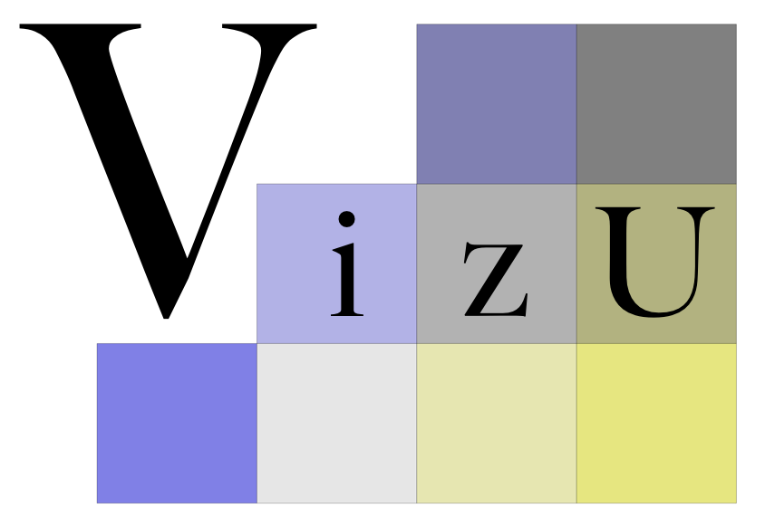

<!-- README.md is generated from README.Rmd. Please edit that file -->
Visualising Uncertainty (VizU) Package
======================================

<h2>
VizU is an R package for visualising uncertainty in spatial data.
</h2>

Installation
------------

You can install a development version of the VizU package from [GitHub](https://github.com/pkuhnert/VizU)

    # install.packages("devtools")
    devtools::install_github(repo = "pkuhnert/VizU", build_vignettes = TRUE, force = TRUE)

Authors
-------

Petra Kuhnert, CSIRO Data61, Email: <Petra.Kuhnert@data61.csiro.au>

Lydia Lucchesi, University of Washington, Email: <lydialuc@uw.edu>

About the Package
-----------------

This package provides three methods for visualising uncertainty in spatial data. These approaches are based on the methods developed in Lucchesi and Wikle (2017) and we have tried to generalise the approaches so they can be applied to most types of spatial data. We welcome any comments or suggestions about the package. Each methods is outlined below with examples.

### Bivariate colour maps

Bivariate colour maps can be created for both areal and point level data. Using a bivariate colour grid, estimates from a spatial model (e.g. mean) and the uncertainty surrounding these values (e.g. standard deviation) are mapped simulataneously. VizU allows the user to create a bivariate colour scheme by mathematically blending two single hue colour palettes and organising them on a 3 x 3 grid. Users can develop their own bivariate colour palette as well as select from some pre-prepared palettes.

Examples
--------

A vignette for the VizU package is available and contains examples relating to each of the visualisation methods.

    vignette("VizU")

License
-------

The package VizU version 1.0.0 is free and open source software, licensed under GPL (&gt;=2)

References
----------

Lucchesi, L.R. and Wikle C.K. (2017) Visualizing uncertainty in areal data with bivariate choropleth maps, map pixelation and glyph rotation, Stat, 10.1002/sta4.150.
