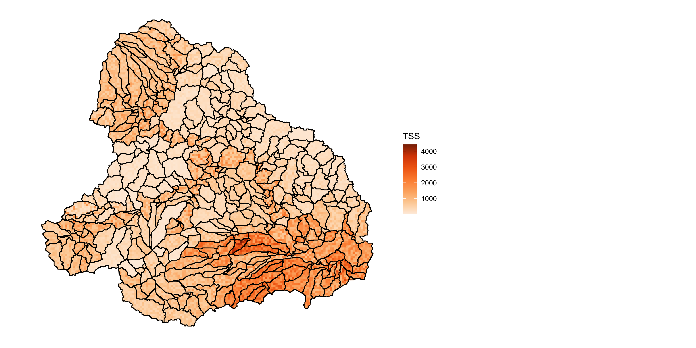

# Summary

To make a sound data-driven decision, it is necessary to consider the quality and strength of the evidence. Therefore, it is important that the uncertainty of statistical estimates be effectively communicated to decision makers to ensure it is properly considered in the decision-making 
process. Generally, this uncertainty information is shared through visualisation (e.g., error bars). However, in spatial applications, finding methods that add additional elements to a map of spatial estimates can be challenging. To address this visualisation shortcoming in spatial 
statistics, we developed the ``Vizumap`` R package, which is a toolkit for visualising uncertainty in spatial data.

``Vizumap`` contains a series of straightforward functions that can be used to create four different types of maps, which are discussed in detail in @vizMethod and @gbrData. The visualisation methods include the bivariate choropleth map, pixel map, glyph map, and exceedance probability map. Following is a brief description of each method.

* For the bivariate choropleth map, two colour scales are merged to create a bivariate grid that can encode the estimates and errors at once, making it possible to fill each region with a single colour that represents both values.

* The pixel map is generated by dividing each region into small pixels, which are then filled with a colour value sampled from the colour gradient range that is encompassed by the estimate plus and minus the error. Areas of greater uncertainty appear pixelated while areas of less uncertainty appear smooth, as though filled by only a single colour. These pixel maps can also be animated so that areas of high uncertainty flicker while areas of low uncertainty appear static to the eye.

* The glyph map is intended to address the issue of unequal region sizes on a choropleth map. Glyphs of equal size are placed at the centroid of each region, filled with a colour that represents the estimate, and rotated depending on the degree of uncertainty.

* Exceedance probability maps show the probability of exceeding a nominated threshold of concern. These probabilities can be pre-calculated and passed to the exceedance probability map function or calculated within the function given a prescribed probability distribution function, estimate, and error.

A comprehensive vignette that demonstrates how to use the ``Vizumap`` functions can be found in the package download. The functions are divided into three categories: formatting, building, and viewing. Formatting functions prepare data for use in the building functions, which are used to build the colour palettes, maps, and map keys. Viewing functions are used to check and combine the different graphical objects designed with the building functions. Previous applications of the ``Vizumap`` R package include visualising American Community Survey estimates with their corresponding margins of error. We believe ``Vizumap`` is useful in a wide range of applications, and we will continue to improve the toolkit to enhance its utility. 

As an illustration below, we use ``Vizumap`` to visualise estimated pollutant loads of sediment from the upper Burdekin catchment in Queensland, Australia, into the Great Barrier Reef (GBR). The predictions and uncertainty, published in @gbrData, were developed from a Bayesian hierarchical model that assimilated estimates of sediment concentration and flow with modelled output from a catchment model developed on the upper Burdekin catchment. Development of this modelling strategy is discussed in @gbrMethod. Here we just focus on total suspended sediment (TSS).  The export of pollutants from coastal catchments within Australia has important implications for the health of the GBR lagoon, and ``Vizumap`` offers a variety of methods for communicating these predictions and uncertainty to catchment managers and policy makers.

## Bivariate map

This bivariate map of the upper Burdekin catchment in Queensland, Australia, depicts predicted sediment concentrations and prediction uncertainty. In this example, a custom colour palette is created and then used to build the bivariate map and colour key. The bivariate bins are defined using terciles.

{width=4in height=4in}

## Pixel map

This pixel map depicts the uncertainty of TSS predictions, while giving a general idea of estimated TSS loads. The colours filling the pixels within each region were sampled from the relative frequency distribution of the estimate. This pixel map can be animated so that the pixels flicker between sampled values. If the map below were to be animated, the areas that appear most pixelated in the static map would, correspondingly, have the most visible movement among pixels in the animated map. Movement among pixels in areas of low uncertainty would be hard to detect due to the minimal differences between the sampled values of orange. An example of an animated pixel map can be found in @vizMethod.
{width=4in height=4in}

## Glyph map

This glyph map of the upper Burdekin catchment depicts estimated TSS loads and the uncertainty of these predictions. The colour filling each glyph (located at the region centroid) represents the estimate, and the rotation of the glyph represents the uncertainty.

{width=4in height=4in}

## Exceedance probability map

This exceedance probability map plots the calculated probability of exceeding a certain threshold of concern (a sediment concentration greater than 837 mg/L) in order to draw attention to the high-risk regions on the map. These probabilities were calculated from the posterior distribution of a Bayesian hierarchical model.

{width=4in height=4in}

# Acknowledgements

``Vizumap`` was built using the following R packages: ``ggplot2``, ``animation``, ``broom``, ``dplyr``, ``geoaxe``, ``ggmap``, ``grDevices``, ``gridExtra``, ``maps``, ``maptools``, ``plyr``, ``reshape2``, ``rgdal``, ``rgeos``, ``roxygen2``, ``sp``, ``spbabel``, and ``utils``.

# References
